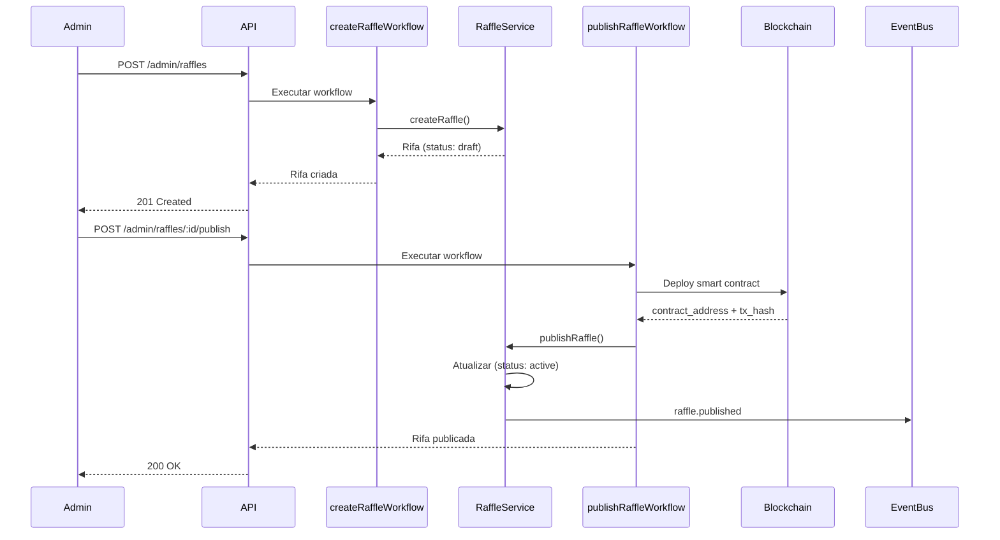
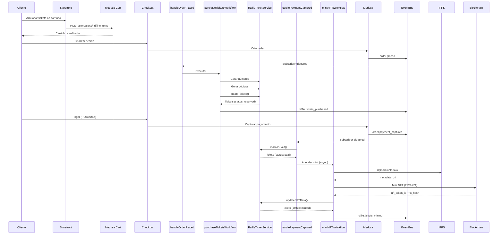
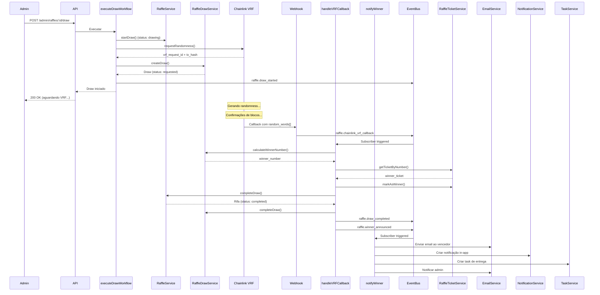

# 🔄 Fluxo Completo do Sistema de Rifas

## Visão Geral

Este documento descreve o fluxo end-to-end de uma rifa, desde a criação até o anúncio do vencedor.

---

## 📋 Fluxo 1: Criação e Publicação de Rifa



**Steps**:
1. Admin cria rifa via API (status: draft)
2. Admin publica rifa
3. Workflow faz deploy na Polygon
4. Rifa fica disponível para compra (status: active)

---

## 🛒 Fluxo 2: Compra de Tickets



**Steps**:
1. Cliente adiciona tickets ao carrinho (produto Medusa normal)
2. Cliente finaliza pedido → `order.placed`
3. **handleOrderPlaced** cria tickets (status: reserved)
4. Cliente paga → `order.payment_captured`
5. **handlePaymentCaptured** marca tickets como pagos
6. **mintNFTsWorkflow** cria NFTs (assíncrono)
7. Tickets ficam com status: minted

---

## 🎲 Fluxo 3: Sorteio (Chainlink VRF)



**Steps**:
1. Admin executa sorteio via API
2. Workflow solicita randomness ao Chainlink VRF
3. Cria registro do sorteio (status: requested)
4. **Aguarda callback do Chainlink** (webhook)
5. **handleVRFCallback** processa resultado:
   - Calcula número vencedor
   - Busca ticket vencedor
   - Marca ticket como vencedor
   - Atualiza rifa (status: completed)
6. **notifyWinner** envia notificações

---

## 🔔 Subscribers e Eventos

### Subscribers Implementados

| Subscriber | Evento | Descrição |
|-----------|--------|-----------|
| `handleOrderPlaced` | `order.placed` | Detecta compra de tickets e cria registros |
| `handlePaymentCaptured` | `order.payment_captured` | Marca tickets como pagos e agenda mint |
| `handleTicketsPurchased` | `raffle.tickets_purchased` | Processa compra (interno) |
| `handleChainlinkVRFCallback` | `raffle.chainlink_vrf_callback` | Processa resultado VRF |
| `notifyWinner` | `raffle.winner_announced` | Notifica vencedor e admin |

### Eventos do Sistema

**Eventos Medusa** (externos):
- `order.placed` - Pedido criado
- `order.payment_captured` - Pagamento capturado

**Eventos Raffle** (internos):
- `raffle.created` - Rifa criada
- `raffle.published` - Rifa publicada (blockchain)
- `raffle.tickets_purchased` - Tickets comprados
- `raffle.tickets_minted` - NFTs criados
- `raffle.draw_started` - Sorteio iniciado
- `raffle.draw_completed` - Sorteio finalizado
- `raffle.winner_announced` - Vencedor anunciado
- `raffle.cancelled` - Rifa cancelada
- `raffle.chainlink_vrf_callback` - Callback VRF (custom)

---

## 🎯 Estados dos Tickets

```
RESERVED → PAID → MINTED → WINNER
    ↓        ↓        ↓
 (carrinho) (pago)  (NFT criado)  (sorteado)
```

---

## 🎰 Estados da Rifa

```
DRAFT → ACTIVE → SOLD_OUT → DRAWING → COMPLETED
                                ↓
                           CANCELLED
```

---

## ⚙️ Configuração de Subscribers no Medusa

Os subscribers são automaticamente registrados pelo Medusa quando:
1. Estão na pasta `subscribers/`
2. Exportam `config` com `SubscriberConfig`
3. Exportam função default assíncrona

Exemplo:
```typescript
export const config: SubscriberConfig = {
  event: "order.placed",
  context: {
    subscriberId: "raffle-order-placed-handler",
  },
};
```

---

## 🔐 Webhook do Chainlink VRF

Para processar o callback do Chainlink, criar endpoint:

```typescript
// src/api/webhooks/chainlink/route.ts
export async function POST(req: MedusaRequest, res: MedusaResponse) {
  const { requestId, randomWords } = req.body;

  // Disparar evento interno
  await eventBusService.emit("raffle.chainlink_vrf_callback", {
    vrf_request_id: requestId,
    random_words: randomWords,
  });

  res.status(200).json({ success: true });
}
```

**URL do webhook**: `https://your-domain.com/webhooks/chainlink`

---

## 🚀 Próximos Passos

Para ativar completamente o sistema:

1. **Integrar services reais** nos subscribers (remover TODOs)
2. **Criar webhook** para Chainlink VRF
3. **Configurar email service** (SendGrid, Resend, etc.)
4. **Configurar notification service** (in-app)
5. **Testar fluxo completo** end-to-end
6. **Deploy smart contracts** (Polygon Mumbai testnet)
7. **Configurar Chainlink subscription** (vrf.chain.link)

---

## ⚠️ Considerações Importantes

### Idempotência
- Subscribers devem ser idempotentes
- Verificar se operação já foi executada
- Usar transaction IDs ou flags no metadata

### Retry Logic
- Subscribers não devem propagar erros fatais
- Implementar retry com exponential backoff
- Usar dead letter queue para falhas críticas

### Performance
- Mint de NFTs é assíncrono (não bloqueia checkout)
- Usar jobs/queues para operações demoradas
- Cachear dados frequentemente acessados

### Segurança
- Validar webhook signatures (Chainlink)
- Rate limiting em endpoints públicos
- Logs estruturados para auditoria
